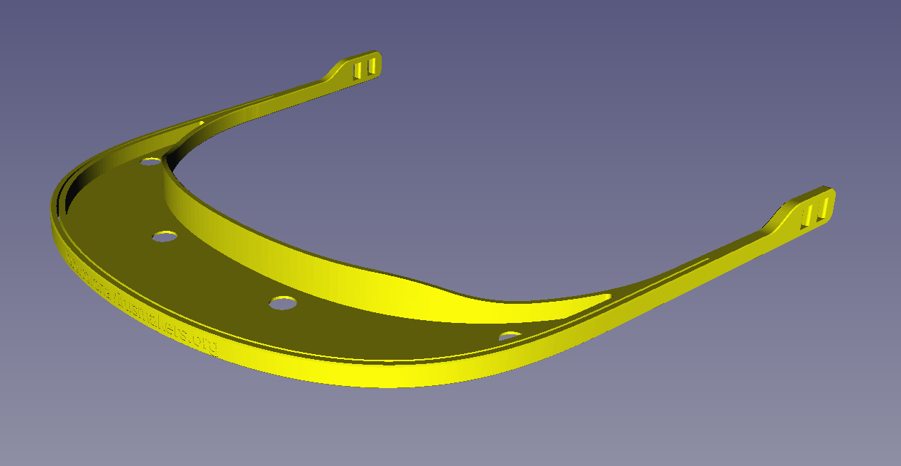

# VISERAS 
Viseras para impresión 3D

# MODELO A IMPRIMIR
El modelo actual a imprimir es el **"Visera plana con ventilacion.stl"**

# PARÁMETROS DE IMPRESIÓN Y MATERIALES REQUERIDOS

* **Parámetros para "Visera plana con ventilación.stl"**
    * Material: PLA o cualquier material resistente a la inmersión en lejía
    * Relleno: 50%
    * Patrón de relleno: Rejilla
    * Número de perímetros: 2
    * Capas superior e inferior: 6
    * Altura de capa: 0.2
    * Soporte: Ninguno
    * Material adicional: hoja pvc/policarbonato de entre 0.25 y 0.4mm tamaño A4

